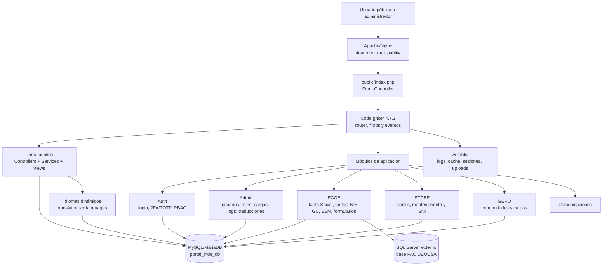

# Manual técnico e instalación: Portal INDE

## 1. Título y descripción general

**Portal INDE** es un portal institucional del Instituto Nacional de Electrificación de Guatemala. La solución combina un portal público multilingüe, consultas de beneficiarios, comunidades, electrificación, cortes de energía, SNI y servicios ECOE, junto con un panel administrativo protegido por autenticación, 2FA/TOTP y control de acceso basado en roles y permisos.

La aplicación es un monolito modular construido sobre CodeIgniter 4. El tráfico HTTP entra por `public/index.php`; el código de negocio está en `app/`, el núcleo del framework en `system/`, las dependencias PHP en `vendor/` y los datos generados en `writable/`.

### Arquitectura conceptual



## 2. Requisitos del sistema y prerrequisitos

### Versiones y componentes

| Componente | Requisito comprobado |
|---|---|
| PHP para ejecución web y CLI | **8.2 o superior**. `public/index.php` y `spark` rechazan versiones anteriores. |
| PHP declarado por Composer | `^8.1`; este requisito es menos restrictivo que el ejecutable real y no debe usarse para producción. |
| Framework | CodeIgniter `4.7.2`, incluido localmente en `system/`. |
| Composer | Compatible con `composer.json`; se recomienda Composer 2.x. |
| Servidor web | Apache con `mod_rewrite` (configuración incluida en `public/.htaccess`) o Nginx con PHP-FPM. |
| Base principal | MySQL o MariaDB compatible con el driver `MySQLi`; versión exacta no está fijada en el repositorio. |
| Base externa ECOE | Microsoft SQL Server mediante `SQLSRV`, host/puerto configurables. |
| PHPUnit | `11.5.55` bloqueado en `composer.lock`. |
| Node.js, npm, Python, C# | No aplican: no existe `package.json` ni otro proyecto de esos runtimes en el repositorio. |

### Extensiones PHP

Las dependencias y el código requieren o utilizan, según la funcionalidad habilitada:

```text
ctype curl dom fileinfo filter gd iconv intl json libxml mbstring
mysqli mysqlnd openssl simplexml sodium xml xmlreader xmlwriter zip zlib
sqlsrv pdo_sqlsrv
```

`sqlsrv` y `pdo_sqlsrv` son necesarios para la conexión ECOE; `xdebug` solo es necesario para escenarios de cobertura. En Windows, las extensiones SQL Server deben corresponder a la versión de PHP, arquitectura y Thread Safety instaladas.

### Dependencias Composer de producción

```text
bacon/bacon-qr-code ^3.0
dompdf/dompdf ^3.1
laminas/laminas-escaper ^2.18
phpoffice/phpspreadsheet ^5.7
psr/log ^3.0
spomky-labs/otphp ^11.3
```

No se debe exponer el directorio raíz como document root. El único document root permitido es `public/`.

## 3. Estructura y módulos de la arquitectura

### Árbol principal

```text
portal-inde/
├── app/
│   ├── Commands/                 # Comandos Spark propios
│   ├── Config/                   # Configuración de aplicación
│   ├── Controllers/              # Controladores globales del portal
│   ├── Database/
│   │   ├── Migrations/           # Evolución del esquema
│   │   ├── Seeds/                # Datos iniciales de catálogo
│   │   └── *.sql                 # Esquemas SQL de referencia/base
│   ├── Filters/                  # Auth, permisos, auditoría, seguridad
│   ├── Helpers/                  # Helpers de aplicación
│   ├── Models/                   # Modelos globales, incluido TranslationModel
│   ├── Modules/
│   │   ├── Admin/                # Administración, RBAC e idiomas
│   │   ├── Auth/                 # Login, sesión y 2FA/TOTP
│   │   ├── Comunicaciones/       # Funciones de comunicaciones
│   │   ├── Ecoe/                 # ECOE: GU, EEM, NIS, tarifas y Tarifa Social
│   │   ├── Etcee/                # ETCEE: cortes, mantenimiento y SNI
│   │   ├── Gero/                 # Comunidades, fuentes y cargas
│   │   └── GerenciaBaseController.php
│   ├── Services/                 # Servicios de dominio globales
│   ├── Views/                    # Vistas globales
│   └── Config/Autoload.php       # Mapeo PSR-4 App\\ -> app/
├── public/                       # Document root y front controller
├── system/                       # Núcleo local de CodeIgniter
├── tests/                        # PHPUnit y pruebas de integración
├── vendor/                       # Dependencias instaladas por Composer
├── writable/                     # Estado escribible de la aplicación
├── composer.json                 # Dependencias y scripts
├── composer.lock                 # Versiones bloqueadas
├── phpunit.xml.dist              # Configuración de pruebas
└── spark                         # CLI de CodeIgniter
```

### Patrón y responsabilidades

La aplicación usa MVC con una organización modular por gerencia o dominio:

- **Rutas:** `app/Config/Routes.php` y `app/Modules/*/Config/Routes.php` registran las URL públicas, API, autenticación y administración.
- **Controladores:** reciben la petición, validan entrada y coordinan servicios/modelos.
- **Controladores base:** `AdminBaseController` valida y refresca el perfil RBAC, y ofrece `adminView()` para renderizar el layout administrativo con contexto compartido. Los controladores públicos usan `BaseController`.
- **Servicios:** encapsulan reglas de negocio y operaciones complejas, por ejemplo `PublicPortalService`, `RbacService`, `TotpService` y `ExcelUploadService`.
- **Modelos:** acceden a MySQL/MariaDB y, para los casos ECOE, a la conexión SQL Server externa.
- **Filtros:** aplican HTTPS, CSRF, autenticación, permisos, modo solo lectura, auditoría y caché.
- **Vistas:** renderizan las pantallas del portal, login, 2FA y administración.
- **Comandos Spark:** ejecutan migraciones, sincronización de permisos y normalización controlada de referencias ECOE.

El sistema no está separado en microservicios. Es un monolito modular con una integración externa de datos ECOE.

Los directorios de módulos actuales son `Admin`, `Auth`, `Comunicaciones`, `Ecoe`, `Etcee` y `Gero`. El gestor de idiomas dinámicos está dentro de `Admin`; no es un directorio independiente. `GerenciaBaseController.php` es una base compartida, no otro módulo. Las rutas se cargan desde `app/Config/Routes.php`.

### Seguridad de rutas, RBAC y 2FA

- El grupo administrativo aplica `adminAuth` y `activityLog`. La portada `/admin` es un punto de entrada para usuarios autorizados al panel; las secciones y endpoints individuales exigen `adminPermission:<slug>`.
- Las rutas de gerencia usan `gerenciaAccess:<slug>,<permission>` para validar sesión, segundo factor y permiso del módulo.
- `csrf` se aplica globalmente a las peticiones de escritura; las excepciones deben limitarse a endpoints que no puedan usar token de sesión y disponer de controles equivalentes.
- `AdminBaseController::authProfile()` valida `session('auth')`, exige 2FA si la cuenta lo tiene activado y refresca el perfil, roles y permisos desde la base de datos antes de autorizar operaciones administrativas.

| Recurso | Protección |
|---------|------------|
| `/admin/idiomas` | `adminAuth`, `activityLog` y `adminPermission:admin.idiomas.view`. |
| `/admin/usuarios` | `adminAuth`, `activityLog` y `adminPermission:admin.usuarios.view`. |
| `/gerencias/ecoe/tarifa-social/tarifas` | `gerenciaAccess:ecoe,gerencia.ecoe.tarifa_social.tarifas.access`. |
| `/admin/etcee/estados-mantenimiento` | `adminAuth`, `activityLog` y `adminPermission:gerencia.etcee.modulo.access`. |

El inicio de sesión está en `AuthController`. El perfil autenticado se guarda bajo `auth` y el identificador de sesión se regenera al iniciar sesión. Cuando se requiere TOTP, se guarda un estado temporal `pending_2fa`; el acceso normal no se completa hasta validar el código. Las contraseñas se almacenan con `password_hash()` y se verifican con `password_verify()`.

Rutas principales de autenticación: `GET/POST /login`, `GET/POST /2fa/verify`, `GET/POST /2fa/setup` y `POST /logout`. El emisor y tolerancia de TOTP se configuran con `security.totpIssuer` y `security.totpLeeway`.

### Traducciones dinámicas y accesibilidad

El portal conserva los archivos nativos de CodeIgniter en `app/Language/` y, en paralelo, usa traducciones dinámicas en base de datos. El helper global `__($key, $default)` resuelve el locale de `session('site_locale')`, normaliza el texto por defecto (espacios, diacríticos y mayúsculas/minúsculas) y reutiliza traducciones aprobadas por `source_text_normalized`, incluso entre claves distintas. Si una clave no existe, la autodetecta y registra para revisión. Los mapas por idioma se cachean.

La tabla `translations` contiene idioma, clave, texto origen, texto origen normalizado, valor e indicador `is_autodiscovered`. La tabla `languages` controla qué idiomas están activos y visibles. La aplicación contempla `es`, `en`, `quc`, `qeq`, `cak`, `mam`, `usp`, `poc`, `poh`, `kjb`, `tzh`, `mop`, `agu`, `chq`, `jac`, `gar` y `xnk`; la barra ofrece los que estén activos y visibles en el catálogo.

El panel `/admin/idiomas` está gestionado por `TranslationsController` y protegido por `admin.idiomas.view`. Ofrece búsqueda, edición, administración del catálogo, importación/exportación y limpieza de caché. La barra de `app/Views/public/layout.php` cambia idioma mediante `POST /api/public/set-language`; los controles A+/A− y alto contraste persisten en `localStorage`.

### Estándar administrativo: CRUD y paginación

- Crear y editar desde un modal único reutilizable; no separar alta/edición en pantallas distintas.
- Confirmar borrados con un modal. Está prohibido usar `window.confirm`.
- Todas las tablas/listados administrativos deben paginar en el backend con `Model::paginate($perPage, $group)` u otra consulta limitada equivalente. Definir tamaño y grupo únicos explícitamente, preservar filtros al navegar y evitar cargar todos los registros en memoria.
- El tamaño estándar para listados administrativos habituales es 15 registros por página; cualquier excepción debe estar definida y justificada por el módulo.
- Renderizar Bootstrap (`pagination`, `page-item`, `page-link`), con números centrados y Anterior/Siguiente deshabilitados en los extremos. Ocultar el paginador si solo hay una página.

La tabla de tarifas mensuales ECOE es la implementación de referencia: límite backend de 15 registros y plantilla `tarifas_bootstrap` en `app/Config/Pager.php`.

### Variables de entorno

El proyecto carga la configuración desde `.env` en la raíz. El siguiente bloque es únicamente una plantilla descriptiva para crear la configuración local; sustituya todos los valores de ejemplo y no copie credenciales reales a documentación, tickets ni control de versiones.

#### Contenido recomendado de `.env.example`

```dotenv
CI_ENVIRONMENT=development

app.baseURL=http://localhost:8080/portal-inde/public
app.defaultLocale=es
app.supportedLocales=es,en,quc,qeq,cak,mam,usp,poc,poh,kjb,tzh,mop,agu,chq,jac,gar,xnk
app.appTimezone=UTC
app.forceGlobalSecureRequests=false
app.CSPEnabled=false

database.default.hostname=127.0.0.1
database.default.database=portal_inde_db
database.default.username=portal_app
database.default.password=CAMBIAR_PASSWORD_MYSQL
database.default.port=3306
database.default.DBDriver=MySQLi
database.default.charset=utf8mb4
database.default.DBCollat=utf8mb4_general_ci
database.default.DBDebug=false

database.ecoe.hostname=sqlserver.interno.example
database.ecoe.database=FAC DEOCSA
database.ecoe.username=ecoe_app
database.ecoe.password=CAMBIAR_PASSWORD_SQLSERVER
database.ecoe.port=1433
database.ecoe.DBDriver=SQLSRV
database.ecoe.DBDebug=false
database.ecoe.deocsa=FAC DEOCSA
database.ecoe.deorsa=FAC DEORSA
database.ecoe.eegsa=FAC EEGSA

security.ajaxCipherKey=base64:GENERAR_32_BYTES_ALEATORIOS_EN_BASE64
security.totpIssuer=Portal INDE
security.totpLeeway=2
security.uploadMaxSizeKB=10240

portal.whatsappGeneral=+50200000000
portal.whatsappTarifaSocial=+50200000001
portal.whatsappElectrificacion=+50200000002
portal.whatsappCortes=+50200000003
portal.whatsappSni=+50200000004
```

`database.ecoe.*` solo debe configurarse si el servidor necesita las funciones ECOE que consultan SQL Server. Las credenciales existentes en un `.env` real deben rotarse y nunca deben copiarse a documentación, repositorios o tickets.

## 4. Base de datos y persistencia

### Conexiones

1. **Conexión `default`:** MySQL/MariaDB, base `portal_inde_db`, charset `utf8mb4`, collation `utf8mb4_general_ci`.
2. **Conexión `ecoe`:** SQL Server externo, base `FAC DEOCSA`, puerto habitual `1433`, driver `SQLSRV`.
3. **Conexión `tests`:** SQLite en memoria con `foreignKeys=true`, activada cuando el entorno es `testing`.

### Tablas y agregados principales

| Área | Tablas principales |
|---|---|
| Seguridad y administración | `gerencias`, `roles`, `permissions`, `users`, `user_roles`, `role_permissions`, `user_permissions`, `upload_logs` |
| Auditoría | `activity_logs` |
| Portal público | `public_beneficiarios`, `public_electrificacion`, `public_cortes_energia`, `public_menu_items` |
| Catálogos y ETCEE | `cat_departamentos`, `cat_municipios`, `etcee_cortes`, `etcee_cortes_ubicaciones`, `etcee_sni_capas`, `etcee_sni_geometrias`, `etcee_sni_lineas_sistema` |
| ECOE | `ecoe_distribuidoras`, `ecoe_nis_base`, `ecoe_ts_estados`, `ecoe_ts_tickets`, `ecoe_ts_adjuntos`, `ecoe_ts_pdf_templates`, `ecoe_ts_bitacora`, `ecoe_formularios`, `ecoe_formulario_campos`, `ecoe_eem_listado` y tablas dinámicas GU/EEM |
| GERO | `gero_comunidades`, `gero_comunidades_bitacora`, `gero_comunidades_fuentes`, `gero_comunidades_fuente_mapeo`, `gero_comunidades_cargas_log` |

### Migraciones y seeds

Toda tabla nueva y todo cambio de esquema debe implementarse exclusivamente mediante migraciones de CodeIgniter 4. Está prohibido ejecutar SQL manual directo para crear, alterar o reparar tablas en desarrollo, staging o producción. Los archivos `.sql` del repositorio son referencias para revisar o convertir a migraciones; no son un procedimiento operativo de instalación o actualización.

Crear y aplicar una migración desde la raíz:

```bash
php spark make:migration NombreDescriptivo
php spark migrate
```

Cada migración debe tener `up()` y `down()` completos, ser revisada/versionada junto con el código y ser idempotente cuando el patrón local lo requiera. Para revisar estado o revertir, usar `php spark migrate:status` y `php spark migrate:rollback`. No corregir fallos de migración ejecutando `ALTER TABLE` manualmente.

Las migraciones en `app/Database/Migrations/` cubren auditoría, portal público, ETCEE, catálogos, SNI, ECOE, GERO, idiomas y funcionalidades recientes como tarifas mensuales ECOE y estados de mantenimiento ETCEE. El seeder `CatalogoUbicacionesSeeder` carga departamentos y municipios de Guatemala.

Ejecutar desde la raíz:

```bash
php spark migrate
php spark db:seed CatalogoUbicacionesSeeder
php spark sync:permissions
```

En XAMPP, si PHP no está en `PATH`:

```bat
C:\xampp\php\php.exe spark migrate
C:\xampp\php\php.exe spark db:seed CatalogoUbicacionesSeeder
C:\xampp\php\php.exe spark sync:permissions
```

Las cargas iniciales de las migraciones core/ECOE y `CatalogoUbicacionesSeeder` agrupan sus escrituras de datos en transacciones InnoDB. Si falla una inserción o actualización, se revierte ese bloque y el error conserva el mensaje SQL y la última consulta. Las operaciones DDL (`CREATE TABLE`, índices y claves foráneas) no forman parte de una transacción global: MySQL puede confirmarlas implícitamente. Por eso una instalación completa no es atómica; después de una falla, revisa el estado de migraciones y vuelve a ejecutar el flujo idempotente tras corregir el error.

### Estado del esquema base y bootstrap limpio

Las migraciones actuales sí incluyen la base de autenticación/RBAC: `2026-05-06-110000_CreateCoreAccessTables` crea `gerencias`, `roles`, `permissions`, `users`, `user_roles`, `role_permissions`, `user_permissions` y `upload_logs`, y carga los datos core en orden de dependencia. Las migraciones posteriores crean los catálogos, portal público y estructuras de ETCEE, ECOE y GERO. En una base MySQL vacía, el procedimiento de bootstrap es ejecutar el conjunto completo con `php spark migrate`; revisa la salida y confirma el estado con `php spark migrate:status`.

`app/Database/inde_core_schema.sql`, `etcee_cortes_schema.sql` y `ecoe_tarifa_social_schema.sql` se conservan como referencias, no como scripts operativos. No los importes ni ejecutes manualmente. En una base preexistente o parcialmente creada, compara el esquema real con `php spark migrate:status` antes de continuar: las migraciones idempotentes que omiten tablas existentes no reparan automáticamente una tabla con columnas o índices incompletos.

Después de migrar, ejecuta `php spark db:seed CatalogoUbicacionesSeeder` para completar departamentos y municipios, y `php spark sync:permissions` tras desplegar permisos/rutas nuevas. Verifica la conexión SQL Server antes de habilitar las funciones ECOE que la requieren.

Antes de ejecutar `ecoe:estandarizar-referencias`, realizar respaldo: el comando recalcula y modifica referencias en datos GU, EEM y Tarifa Social.

## 5. Guía de instalación y configuración

### Instalación local en Windows/XAMPP

1. Instale XAMPP con PHP 8.2 o superior, Apache y MySQL/MariaDB. Habilite las extensiones indicadas en `php.ini`, reinicie Apache y verifique:

   ```bat
   C:\xampp\php\php.exe -v
   C:\xampp\php\php.exe -m
   ```

2. Clone el repositorio en la carpeta de trabajo:

   ```bat
   cd C:\xampp\htdocs
   git clone <URL_DEL_REPOSITORIO> portal-inde
   cd portal-inde
   ```

3. Instale las dependencias PHP bloqueadas:

   ```bat
   composer install
   ```

   Si Composer no está en `PATH`, use el ejecutable instalado en su equipo. El repositorio también contiene `composer.phar`, que puede invocarse con PHP 8.2.

4. Cree `.env` en la raíz y configure, como mínimo, `CI_ENVIRONMENT`, `app.baseURL`, `database.default.*`, `database.ecoe.*` si aplica y `security.ajaxCipherKey`. No use en producción la contraseña vacía de `root` ni la clave de ejemplo.

5. Configure una base de datos MySQL/MariaDB y las credenciales de mínimo privilegio. Antes de usar una base vacía, revise el estado de la migración base RBAC descrito en **Estado del esquema base y bootstrap limpio**; no ejecute archivos `.sql` manualmente.

6. En una base ya aprovisionada, ejecute migraciones, catálogo y permisos:

   ```bat
   C:\xampp\php\php.exe spark migrate
   C:\xampp\php\php.exe spark db:seed CatalogoUbicacionesSeeder
   C:\xampp\php\php.exe spark sync:permissions
   ```

7. Verifique la aplicación desde `http://localhost/portal-inde/public/` o la URL equivalente a `app.baseURL`. Las rutas de autenticación son `/login`, `/2fa/setup` y `/2fa/verify`.

8. Ejecute las pruebas:

   ```bat
   C:\xampp\php\php.exe vendor\bin\phpunit
   ```

### Instalación local con el instalador web

`public/auto_installer.php` es una alternativa para configurar `.env` y solicitar la ejecución de migraciones desde un navegador local. No sustituye la preparación de una base vacía ni los pasos de catálogo/permisos:

1. Instale dependencias y prepare la base MySQL/MariaDB con un usuario de mínimo privilegio. El usuario necesita permiso para crear la base si todavía no existe.
2. En XAMPP, abra `http://localhost/portal-inde/public/auto_installer.php`. El instalador solo acepta conexiones desde `127.0.0.1` o `::1`; abrirlo desde otro equipo devuelve `403`.
3. Configure URL base, conexión MySQL, integración SQL Server ECOE si aplica, clave AJAX de 32 bytes y emisor TOTP. Si `.env` no existe, el instalador lo crea fuera de `public/`. Si ya existe, solo reemplázalo con **Forzar reconfiguración**; se guarda un respaldo.
4. Al crear o cambiar `.env`, las migraciones se ejecutan automáticamente. Si la configuración no cambia, marca **Ejecutar migraciones pendientes** para solicitarlas. Revisa toda la salida del paso de migraciones y resuelve cualquier error antes de continuar.
5. En una base que ya tenga el esquema requerido, ejecuta `php spark db:seed CatalogoUbicacionesSeeder` y `php spark sync:permissions` desde la raíz, o sus comandos equivalentes con `C:\xampp\php\php.exe` en XAMPP.
6. Marca **Renombrar y deshabilitar este instalador** solo cuando todos los pasos finalicen sin errores. Después confirma que `public/auto_installer.php` fue renombrado o elimínalo manualmente.

El instalador no convierte los archivos SQL de referencia en un bootstrap autorizado. El estado de migración base descrito en **Estado del esquema base y bootstrap limpio** sigue aplicando: `spark migrate` no garantiza por sí solo una base vacía totalmente inicializada. No expongas ni habilites el instalador en un servidor público.

### Actualizar desde el módulo Admin

El módulo de paquetes está disponible en `/admin/update`; requiere iniciar sesión como **superadministrador**. Las migraciones se administran por separado en `/admin/migraciones`, también solo para superadministrador.

1. Haz un respaldo comprobado de la base MySQL y de `writable/uploads/`. Anota la versión/revisión actual y prueba el paquete primero en un entorno de staging.
2. Clasifica el cambio antes de actualizar:
    - Controladores, modelos, vistas, configuración, dependencias y cualquier otro código PHP se despliegan desde Git/repositorio. Nunca se distribuyen dentro del ZIP.
    - Cambios de esquema se despliegan junto con sus migraciones versionadas. Después de desplegar el código, entra a `/admin/migraciones`, revisa pendientes y ejecuta **latest**; también se puede ejecutar `php spark migrate` desde la raíz.
    - El ZIP de `/admin/update` transporta datos seleccionados y archivos físicos permitidos, no reemplaza el despliegue de código ni ejecuta archivos PHP.
3. En el sistema origen, entra a `/admin/update`, selecciona el módulo y pulsa **Analizar módulo**. Revisa las tablas/filas seleccionadas; el preview muestra hasta 30 filas por tabla. Columnas sensibles/binarias y tablas sin una clave primaria simple no se exportan. El máximo es 50.000 registros por paquete.
4. Revisa el paso **Archivos referenciados**. El escaneo solo acepta raíces permitidas del módulo y recursos físicos existentes. Confirma cuidadosamente el contenido antes de generar y descargar el ZIP.
5. El modo de datos generado es `insert_missing`: al importar, inserta filas faltantes y actualiza coincidencias de clave primaria/índice único; los conflictos sin cambios se reportan por separado. La importación de datos está en una transacción y temporalmente desactiva/restaura los checks FK de MySQL. Esto no hace atómica la instalación completa de archivos, migraciones y base de datos.
6. Transfiere el ZIP mediante un canal autorizado al destino. Inicia sesión allí como superadministrador, abre `/admin/update`, selecciona el archivo y pulsa **Validar e instalar**. El sistema valida formato, módulo, rutas y checksums antes de procesarlo.
7. El ZIP debe pesar como máximo 25 MB, contener hasta 2.000 entradas y expandirse a no más de 100 MB. Si una validación o escritura falla, consulta el reporte del módulo y los logs; no vuelvas a importar a ciegas. Corrige primero el esquema/dato conflictivo y restaura el respaldo si hace falta.
8. Comprueba el reporte por tabla y archivo, revisa los datos y recursos en destino y valida las funciones del módulo. Conserva el ZIP y el respaldo según la política de cambios.

Los paquetes pueden incluir JSON de datos, imágenes, cargas y recursos estáticos permitidos. Cualquier ruta con extensión `.php` (sin distinguir mayúsculas/minúsculas) se excluye al empaquetar y se rechaza al importar. No uses este módulo para desplegar código fuente.

### Apache y VirtualHost

El repositorio incluye `public/.htaccess`, que requiere `mod_rewrite`. El document root recomendado debe apuntar a `public/`, no a la raíz del proyecto. También hay un `.htaccess` en la raíz para instalaciones XAMPP/subcarpeta que reescribe internamente hacia `public/`; úsalo solo cuando no puedas configurar el document root recomendado y habilita `FollowSymLinks` y `AllowOverride`.

```apache
<VirtualHost *:80>
    ServerName portal-inde.local
    DocumentRoot "C:/xampp/htdocs/portal-inde/public"

    <Directory "C:/xampp/htdocs/portal-inde/public">
        AllowOverride All
        Require all granted
    </Directory>

    ErrorLog "C:/xampp/apache/logs/portal-inde-error.log"
    CustomLog "C:/xampp/apache/logs/portal-inde-access.log" combined
</VirtualHost>
```

Añada `127.0.0.1 portal-inde.local` al archivo `hosts`, habilite `mod_rewrite` y reinicie Apache. En producción, configure HTTPS y ajuste `app.forceGlobalSecureRequests=true`.

### Nginx y PHP-FPM

No existe una configuración Nginx en el repositorio. Un bloque mínimo debe proteger el resto del proyecto y enviar las rutas al front controller:

```nginx
server {
    listen 80;
    server_name portal-inde.example;
    root /var/www/portal-inde/public;
    index index.php;

    location / {
        try_files $uri $uri/ /index.php?$query_string;
    }

    location ~ \.php$ {
        include fastcgi_params;
        fastcgi_param SCRIPT_FILENAME $document_root$fastcgi_script_name;
        fastcgi_pass unix:/run/php/php8.2-fpm.sock;
    }

    location ~ ^/(app|system|vendor|writable|\.env) {
        deny all;
    }
}
```

### Permisos

El usuario de Apache/PHP-FPM debe tener escritura sobre:

```text
writable/
writable/cache/
writable/logs/
writable/session/
writable/tmp/
writable/uploads/
```

En Linux, un ejemplo de preparación es:

```bash
sudo chown -R www-data:www-data writable/
sudo find writable/ -type d -exec chmod 775 {} \;
sudo find writable/ -type f -exec chmod 664 {} \;
```

Mantenga `app/`, `system/`, `public/` y `vendor/` sin permisos de escritura para el proceso web siempre que la operación lo permita.

### Directorios y archivos protegidos

| Ruta | Acceso HTTP | Permisos del proceso web |
|------|-------------|--------------------------|
| `app/`, `system/`, `vendor/` | No deben ser accesibles directamente. | Lectura; sin escritura durante la operación normal. |
| `writable/` | No debe exponerse ni permitir descarga directa. | Escritura solo en las carpetas necesarias (`cache/`, `logs/`, `session/`, `tmp/`, `uploads/`). |
| `.env` | Nunca debe ser servido por Apache/Nginx ni incluido en el control de versiones. | Lectura para PHP; acceso restringido a administradores del servidor. |
| `public/` | Único document root permitido; solo recursos públicos y `index.php`. | Mantener el código de despliegue sin escritura por el proceso web. |

En producción, las reglas del servidor deben denegar el acceso a dotfiles y a `app/`, `system/`, `vendor/` y `writable/`. No cambie `writable/` a permisos globales `777`; conceda acceso únicamente al usuario de Apache/PHP-FPM.

## 6. Mantenimiento, logs y solución de problemas

### Logs y estado persistente

| Recurso | Ubicación |
|---|---|
| Logs de CodeIgniter | `writable/logs/` |
| Caché de archivos | `writable/cache/` |
| Sesiones | `writable/session/` |
| Temporales | `writable/tmp/` |
| Cargas | `writable/uploads/` |
| Auditoría HTTP | Tabla `activity_logs` |
| Apache en XAMPP | `C:\xampp\apache\logs\error.log` y `C:\xampp\apache\logs\access.log` |
| MySQL en XAMPP | `C:\xampp\mysql\data\mysql_error.log` o el log configurado por XAMPP |
| PHP-FPM/Nginx | Logs configurados por la distribución, normalmente `/var/log/php8.2-fpm.log` y `/var/log/nginx/` |
| Cache de PHPUnit | `build/.phpunit.cache` |

El nivel de log configurado es `9` en desarrollo y `4` en producción. No se deben mostrar errores detallados en producción (`DBDebug=false`).

### Comandos de verificación

```bash
php -v
php -m
composer check-platform-reqs
php spark list
php spark migrate:status
php vendor/bin/phpunit
```

En XAMPP:

```bat
C:\xampp\php\php.exe -v
C:\xampp\php\php.exe -m
composer check-platform-reqs
C:\xampp\php\php.exe spark list
C:\xampp\php\php.exe spark migrate:status
C:\xampp\php\php.exe vendor\bin\phpunit
```

Comprobar conectividad de bases de datos desde el servidor:

```bash
mysql -h 127.0.0.1 -P 3306 -u portal_app -p -e "SELECT 1;"
```

Para SQL Server, valide que el puerto `1433` sea accesible y que el driver `sqlsrv` aparezca en `php -m`; la aplicación requiere además credenciales y permisos válidos en la base ECOE.

### Problemas frecuentes

| Síntoma | Diagnóstico y acción |
|---|---|
| `PHP 8.2 or higher is required` | Apache o CLI usa otra instalación de PHP. Verifique `php -v`, la versión de Apache y `C:\xampp\php\php.exe`. |
| `Class not found` después del clonado | Ejecute `composer install` y confirme que `vendor/autoload.php` exista. |
| Error 404 en rutas internas | El document root no apunta a `public/`, `mod_rewrite` está deshabilitado o `AllowOverride All` no está activo. |
| No se puede escribir en caché, sesiones o uploads | Ajuste permisos/ACL de `writable/` y compruebe `writable/logs/`. |
| Fallo de conexión MySQL | Revise `database.default.*`, que MySQL esté iniciado y que la base exista y sea accesible para el usuario de aplicación. |
| Fallo de conexión ECOE | Revise red hacia el servidor SQL Server, `sqlsrv`/`pdo_sqlsrv`, puerto 1433, nombre de base y credenciales. |
| Tablas `users` o `roles` inexistentes | Compruebe `php spark migrate:status`. El repositorio aún requiere una migración base RBAC para bootstrap limpio; no ejecute `inde_core_schema.sql` manualmente como workaround. |
| Migración falla por tabla existente | Haga respaldo, revise `php spark migrate:status` y determine si la base fue inicializada con un esquema parcial. No borre tablas en producción para forzar la migración. |
| Login/2FA no funciona | Compruebe tablas RBAC, hora del servidor, `security.totpIssuer`, la sesión escribible y que el usuario tenga roles/permisos. |
| `ERR_TOO_MANY_REDIRECTS` entre `/login` y `/admin` | Confirme que `baseURL`, host y protocolo coincidan y que el navegador conserve `ci_session`. Revise `session('auth')`, 2FA pendiente y que el destino de login corresponda a un permiso que el filtro acepta. Elimine cookies antiguas del host después de corregir configuración. |
| CSRF rechaza una petición POST | Compruebe que el formulario renderiza `csrf_field()`, que AJAX envía el token vigente y que la excepción global, si existe, está limitada al endpoint previsto. |
| Idioma o traducción no se actualiza | Verifique `site_locale`, el estado activo/visible en `languages` y la clave/texto normalizado en `translations`; limpie el caché desde `/admin/idiomas` si corresponde. |
| Archivos descargables públicamente | Revise que las cargas estén bajo `writable/` y que las descargas pasen por controladores autenticados, no por una URL directa. |

### Operación segura antes de producción

```text
1. Rotar cualquier credencial que haya estado en .env o en control de versiones.
2. Cambiar la contraseña temporal de superadmin y habilitar 2FA.
3. Generar una nueva security.ajaxCipherKey aleatoria.
4. Crear un usuario de base con privilegios mínimos; no usar root ni sa para la aplicación.
5. Activar HTTPS y revisar CSP y secureheaders.
6. Confirmar que .env, app/, system/, vendor/ y writable/ no sean accesibles por HTTP.
7. Respaldar MySQL antes de migraciones o de `ecoe:estandarizar-referencias`; no ejecutar cambios de esquema con SQL manual.
8. Revisar rotación, retención y acceso a writable/logs/ y activity_logs.
9. Ejecutar pruebas y comprobar rutas públicas, login, administración y conexión ECOE.
```