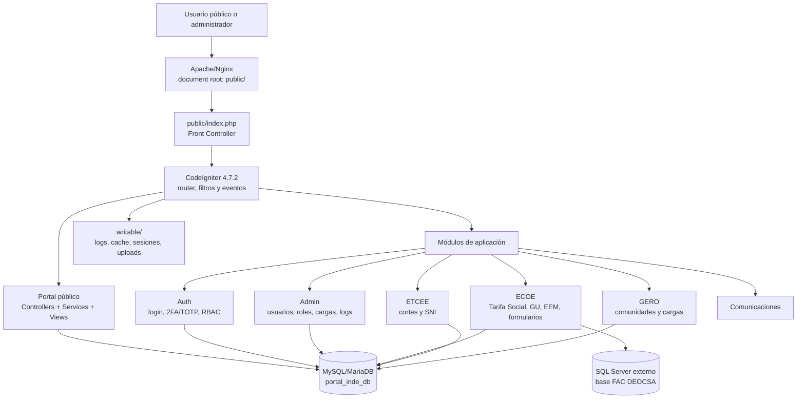

# Manual técnico e instalación: Portal INDE

## 1. Título y descripción general

**Portal INDE** es un portal institucional del Instituto Nacional de Electrificación de Guatemala. La solución combina un portal público multilingüe, consultas de beneficiarios, comunidades, electrificación, cortes de energía, SNI y servicios ECOE, junto con un panel administrativo protegido por autenticación, 2FA/TOTP y control de acceso basado en roles y permisos.

La aplicación es un monolito modular construido sobre CodeIgniter 4. El tráfico HTTP entra por `public/index.php`; el código de negocio está en `app/`, el núcleo del framework en `system/`, las dependencias PHP en `vendor/` y los datos generados en `writable/`.

### Arquitectura conceptual



## 2. Requisitos del sistema y prerrequisitos

### Versiones y componentes

| Componente | Requisito comprobado |
|---|---|
| PHP para ejecución web y CLI | **8.2 o superior**. `public/index.php` y `spark` rechazan versiones anteriores. |
| PHP declarado por Composer | `^8.1`; este requisito es menos restrictivo que el ejecutable real y no debe usarse para producción. |
| Framework | CodeIgniter `4.7.2`, incluido localmente en `system/`. |
| Composer | Compatible con `composer.json`; se recomienda Composer 2.x. |
| Servidor web | Apache con `mod_rewrite` (configuración incluida en `public/.htaccess`) o Nginx con PHP-FPM. |
| Base principal | MySQL o MariaDB compatible con el driver `MySQLi`; versión exacta no está fijada en el repositorio. |
| Base externa ECOE | Microsoft SQL Server mediante `SQLSRV`, host/puerto configurables. |
| PHPUnit | `11.5.55` bloqueado en `composer.lock`. |
| Node.js, npm, Python, C# | No aplican: no existe `package.json` ni otro proyecto de esos runtimes en el repositorio. |

### Extensiones PHP

Las dependencias y el código requieren o utilizan, según la funcionalidad habilitada:

```text
ctype curl dom fileinfo filter gd iconv intl json libxml mbstring
mysqli mysqlnd openssl simplexml sodium xml xmlreader xmlwriter zip zlib
sqlsrv pdo_sqlsrv
```

`sqlsrv` y `pdo_sqlsrv` son necesarios para la conexión ECOE; `xdebug` solo es necesario para escenarios de cobertura. En Windows, las extensiones SQL Server deben corresponder a la versión de PHP, arquitectura y Thread Safety instaladas.

### Dependencias Composer de producción

```text
bacon/bacon-qr-code ^3.0
dompdf/dompdf ^2.0
laminas/laminas-escaper ^2.18
phpoffice/phpspreadsheet ^5.7
psr/log ^3.0
spomky-labs/otphp ^11.3
```

No se debe exponer el directorio raíz como document root. El único document root permitido es `public/`.

## 3. Estructura y módulos de la arquitectura

### Árbol principal

```text
portal-inde/
├── app/
│   ├── Commands/                 # Comandos Spark propios
│   ├── Config/                   # Configuración de aplicación
│   ├── Controllers/              # Controladores globales del portal
│   ├── Database/
│   │   ├── Migrations/           # Evolución del esquema
│   │   ├── Seeds/                # Datos iniciales de catálogo
│   │   └── *.sql                 # Esquemas SQL de referencia/base
│   ├── Filters/                  # Auth, permisos, auditoría, seguridad
│   ├── Helpers/                  # Helpers de aplicación
│   ├── Modules/
│   │   ├── Admin/                # Administración y RBAC
│   │   ├── Auth/                 # Login, sesión y 2FA/TOTP
│   │   ├── Comunicaciones/       # Funciones de comunicaciones
│   │   ├── Ecoe/                 # ECOE: GU, EEM, Tarifa Social
│   │   ├── Etcee/                # ETCEE: cortes y SNI
│   │   └── Gero/                 # Comunidades, fuentes y cargas
│   ├── Services/                 # Servicios de dominio globales
│   ├── Views/                    # Vistas globales
│   └── Config/Autoload.php       # Mapeo PSR-4 App\\ -> app/
├── public/                       # Document root y front controller
├── system/                       # Núcleo local de CodeIgniter
├── tests/                        # PHPUnit y pruebas de integración
├── vendor/                       # Dependencias instaladas por Composer
├── writable/                     # Estado escribible de la aplicación
├── composer.json                 # Dependencias y scripts
├── composer.lock                 # Versiones bloqueadas
├── phpunit.xml.dist              # Configuración de pruebas
└── spark                         # CLI de CodeIgniter
```

### Patrón y responsabilidades

La aplicación usa MVC con una organización modular por gerencia o dominio:

- **Rutas:** `app/Config/Routes.php` y `app/Modules/*/Config/Routes.php` registran las URL públicas, API, autenticación y administración.
- **Controladores:** reciben la petición, validan entrada y coordinan servicios/modelos.
- **Servicios:** encapsulan reglas de negocio y operaciones complejas, por ejemplo `PublicPortalService`, `RbacService`, `TotpService` y `ExcelUploadService`.
- **Modelos:** acceden a MySQL/MariaDB y, para los casos ECOE, a la conexión SQL Server externa.
- **Filtros:** aplican HTTPS, CSRF, autenticación, permisos, modo solo lectura, auditoría y caché.
- **Vistas:** renderizan las pantallas del portal, login, 2FA y administración.
- **Comandos Spark:** ejecutan migraciones, sincronización de permisos y normalización controlada de referencias ECOE.

El sistema no está separado en microservicios. Es un monolito modular con una integración externa de datos ECOE.

### Variables de entorno

El proyecto utiliza `.env` en la raíz. El repositorio auditado contiene `.env`, pero no contiene `env` ni `.env.example`; el siguiente bloque es una plantilla segura y descriptiva para crear un entorno nuevo. Sustituya todos los valores de ejemplo antes de ejecutar la aplicación.

#### Contenido recomendado de `.env.example`

```dotenv
CI_ENVIRONMENT=development

app.baseURL=http://localhost:8080/portal-inde/public
app.defaultLocale=es
app.supportedLocales=es,en,quc,qeq,cak
app.appTimezone=UTC
app.forceGlobalSecureRequests=false
app.CSPEnabled=false

database.default.hostname=127.0.0.1
database.default.database=portal_inde_db
database.default.username=portal_app
database.default.password=CAMBIAR_PASSWORD_MYSQL
database.default.port=3306
database.default.DBDriver=MySQLi
database.default.charset=utf8mb4
database.default.DBCollat=utf8mb4_general_ci
database.default.DBDebug=false

database.ecoe.hostname=sqlserver.interno.example
database.ecoe.database=FAC DEOCSA
database.ecoe.username=ecoe_app
database.ecoe.password=CAMBIAR_PASSWORD_SQLSERVER
database.ecoe.port=1433
database.ecoe.DBDriver=SQLSRV
database.ecoe.DBDebug=false

security.ajaxCipherKey=base64:GENERAR_32_BYTES_ALEATORIOS_EN_BASE64
security.totpIssuer=Portal INDE
security.totpLeeway=2
security.uploadMaxSizeKB=10240

portal.whatsappGeneral=+50200000000
portal.whatsappTarifaSocial=+50200000001
portal.whatsappElectrificacion=+50200000002
portal.whatsappCortes=+50200000003
portal.whatsappSni=+50200000004
```

`database.ecoe.*` solo debe configurarse si el servidor necesita las funciones ECOE que consultan SQL Server. Las credenciales existentes en un `.env` real deben rotarse y nunca deben copiarse a documentación, repositorios o tickets.

## 4. Base de datos y persistencia

### Conexiones

1. **Conexión `default`:** MySQL/MariaDB, base `portal_inde_db`, charset `utf8mb4`, collation `utf8mb4_general_ci`.
2. **Conexión `ecoe`:** SQL Server externo, base `FAC DEOCSA`, puerto habitual `1433`, driver `SQLSRV`.
3. **Conexión `tests`:** SQLite en memoria con `foreignKeys=true`, activada cuando el entorno es `testing`.

### Tablas y agregados principales

| Área | Tablas principales |
|---|---|
| Seguridad y administración | `gerencias`, `roles`, `permissions`, `users`, `user_roles`, `role_permissions`, `user_permissions`, `upload_logs` |
| Auditoría | `activity_logs` |
| Portal público | `public_beneficiarios`, `public_electrificacion`, `public_cortes_energia`, `public_menu_items` |
| Catálogos y ETCEE | `cat_departamentos`, `cat_municipios`, `etcee_cortes`, `etcee_cortes_ubicaciones`, `etcee_sni_capas`, `etcee_sni_geometrias`, `etcee_sni_lineas_sistema` |
| ECOE | `ecoe_distribuidoras`, `ecoe_nis_base`, `ecoe_ts_estados`, `ecoe_ts_tickets`, `ecoe_ts_adjuntos`, `ecoe_ts_pdf_templates`, `ecoe_ts_bitacora`, `ecoe_formularios`, `ecoe_formulario_campos`, `ecoe_eem_listado` y tablas dinámicas GU/EEM |
| GERO | `gero_comunidades`, `gero_comunidades_bitacora`, `gero_comunidades_fuentes`, `gero_comunidades_fuente_mapeo`, `gero_comunidades_cargas_log` |

### Migraciones y seeds

Las migraciones se encuentran en `app/Database/Migrations/` y cubren auditoría, portal público, ETCEE, catálogos, SNI, ECOE y GERO. El seeder disponible es `CatalogoUbicacionesSeeder`, que carga departamentos y municipios de Guatemala.

Ejecutar desde la raíz:

```bash
php spark migrate
php spark db:seed CatalogoUbicacionesSeeder
php spark sync:permissions
```

En XAMPP, si PHP no está en `PATH`:

```bat
C:\xampp\php\php.exe spark migrate
C:\xampp\php\php.exe spark db:seed CatalogoUbicacionesSeeder
C:\xampp\php\php.exe spark sync:permissions
```

### Esquema base y orden de inicialización

El archivo `app/Database/inde_core_schema.sql` crea la base/tablas base de autenticación y RBAC, además de datos iniciales. Las migraciones actuales no crean claramente todas esas tablas, por lo que una instalación limpia no debe ejecutar únicamente `spark migrate`.

Con MySQL disponible en `PATH`, importar el esquema base así:

```bash
mysql -u root -p < app/Database/inde_core_schema.sql
```

Después ejecutar las migraciones y el seeder. Si la base o el usuario ya existen, revisar el SQL y hacer un respaldo antes de importarlo. Los archivos `etcee_cortes_schema.sql` y `ecoe_tarifa_social_schema.sql` son esquemas de referencia; no deben ejecutarse a ciegas sobre una instalación existente.

Orden recomendado:

```text
1. Crear usuario/base MySQL y preparar credenciales.
2. Importar inde_core_schema.sql en una instalación nueva.
3. Ejecutar php spark migrate.
4. Ejecutar php spark db:seed CatalogoUbicacionesSeeder.
5. Ejecutar php spark sync:permissions.
6. Verificar la conexión SQL Server antes de habilitar funciones ECOE.
```

Antes de ejecutar `ecoe:estandarizar-referencias`, realizar respaldo: el comando recalcula y modifica referencias en datos GU, EEM y Tarifa Social.

## 5. Guía de instalación y configuración

### Instalación local en Windows/XAMPP

1. Instale XAMPP con PHP 8.2 o superior, Apache y MySQL/MariaDB. Habilite las extensiones indicadas en `php.ini`, reinicie Apache y verifique:

   ```bat
   C:\xampp\php\php.exe -v
   C:\xampp\php\php.exe -m
   ```

2. Clone el repositorio en la carpeta de trabajo:

   ```bat
   cd C:\xampp\htdocs
   git clone <URL_DEL_REPOSITORIO> portal-inde
   cd portal-inde
   ```

3. Instale las dependencias PHP bloqueadas:

   ```bat
   composer install
   ```

   Si Composer no está en `PATH`, use el ejecutable instalado en su equipo. El repositorio también contiene `composer.phar`, que puede invocarse con PHP 8.2.

4. Cree `.env` en la raíz y configure, como mínimo, `CI_ENVIRONMENT`, `app.baseURL`, `database.default.*`, `database.ecoe.*` si aplica y `security.ajaxCipherKey`. No use en producción la contraseña vacía de `root` ni la clave de ejemplo.

5. Cree la base principal e importe el esquema de seguridad/RBAC:

   ```bat
   C:\xampp\mysql\bin\mysql.exe -u root -p < app\Database\inde_core_schema.sql
   ```

6. Ejecute migraciones, catálogo y permisos:

   ```bat
   C:\xampp\php\php.exe spark migrate
   C:\xampp\php\php.exe spark db:seed CatalogoUbicacionesSeeder
   C:\xampp\php\php.exe spark sync:permissions
   ```

7. Verifique la aplicación desde `http://localhost/portal-inde/public/` o la URL equivalente a `app.baseURL`. Las rutas de autenticación son `/login`, `/2fa/setup` y `/2fa/verify`.

8. Ejecute las pruebas:

   ```bat
   C:\xampp\php\php.exe vendor\bin\phpunit
   ```

### Apache y VirtualHost

El repositorio incluye `public/.htaccess`, que requiere `mod_rewrite`. El document root debe apuntar a `public/`, no a la raíz del proyecto. Ejemplo de VirtualHost:

```apache
<VirtualHost *:80>
    ServerName portal-inde.local
    DocumentRoot "C:/xampp/htdocs/portal-inde/public"

    <Directory "C:/xampp/htdocs/portal-inde/public">
        AllowOverride All
        Require all granted
    </Directory>

    ErrorLog "C:/xampp/apache/logs/portal-inde-error.log"
    CustomLog "C:/xampp/apache/logs/portal-inde-access.log" combined
</VirtualHost>
```

Añada `127.0.0.1 portal-inde.local` al archivo `hosts`, habilite `mod_rewrite` y reinicie Apache. En producción, configure HTTPS y ajuste `app.forceGlobalSecureRequests=true`.

### Nginx y PHP-FPM

No existe una configuración Nginx en el repositorio. Un bloque mínimo debe proteger el resto del proyecto y enviar las rutas al front controller:

```nginx
server {
    listen 80;
    server_name portal-inde.example;
    root /var/www/portal-inde/public;
    index index.php;

    location / {
        try_files $uri $uri/ /index.php?$query_string;
    }

    location ~ \.php$ {
        include fastcgi_params;
        fastcgi_param SCRIPT_FILENAME $document_root$fastcgi_script_name;
        fastcgi_pass unix:/run/php/php8.2-fpm.sock;
    }

    location ~ ^/(app|system|vendor|writable|\.env) {
        deny all;
    }
}
```

### Permisos

El usuario de Apache/PHP-FPM debe tener escritura sobre:

```text
writable/
writable/cache/
writable/logs/
writable/session/
writable/tmp/
writable/uploads/
```

En Linux, un ejemplo de preparación es:

```bash
sudo chown -R www-data:www-data writable/
sudo find writable/ -type d -exec chmod 775 {} \;
sudo find writable/ -type f -exec chmod 664 {} \;
```

Mantenga `app/`, `system/`, `public/` y `vendor/` sin permisos de escritura para el proceso web siempre que la operación lo permita.

## 6. Mantenimiento, logs y solución de problemas

### Logs y estado persistente

| Recurso | Ubicación |
|---|---|
| Logs de CodeIgniter | `writable/logs/` |
| Caché de archivos | `writable/cache/` |
| Sesiones | `writable/session/` |
| Temporales | `writable/tmp/` |
| Cargas | `writable/uploads/` |
| Auditoría HTTP | Tabla `activity_logs` |
| Apache en XAMPP | `C:\xampp\apache\logs\error.log` y `C:\xampp\apache\logs\access.log` |
| MySQL en XAMPP | `C:\xampp\mysql\data\mysql_error.log` o el log configurado por XAMPP |
| PHP-FPM/Nginx | Logs configurados por la distribución, normalmente `/var/log/php8.2-fpm.log` y `/var/log/nginx/` |
| Cache de PHPUnit | `build/.phpunit.cache` |

El nivel de log configurado es `9` en desarrollo y `4` en producción. No se deben mostrar errores detallados en producción (`DBDebug=false`).

### Comandos de verificación

```bash
php -v
php -m
composer check-platform-reqs
php spark list
php spark migrate:status
php vendor/bin/phpunit
```

En XAMPP:

```bat
C:\xampp\php\php.exe -v
C:\xampp\php\php.exe -m
composer check-platform-reqs
C:\xampp\php\php.exe spark list
C:\xampp\php\php.exe spark migrate:status
C:\xampp\php\php.exe vendor\bin\phpunit
```

Comprobar conectividad de bases de datos desde el servidor:

```bash
mysql -h 127.0.0.1 -P 3306 -u portal_app -p -e "SELECT 1;"
```

Para SQL Server, valide que el puerto `1433` sea accesible y que el driver `sqlsrv` aparezca en `php -m`; la aplicación requiere además credenciales y permisos válidos en la base ECOE.

### Problemas frecuentes

| Síntoma | Diagnóstico y acción |
|---|---|
| `PHP 8.2 or higher is required` | Apache o CLI usa otra instalación de PHP. Verifique `php -v`, la versión de Apache y `C:\xampp\php\php.exe`. |
| `Class not found` después del clonado | Ejecute `composer install` y confirme que `vendor/autoload.php` exista. |
| Error 404 en rutas internas | El document root no apunta a `public/`, `mod_rewrite` está deshabilitado o `AllowOverride All` no está activo. |
| No se puede escribir en caché, sesiones o uploads | Ajuste permisos/ACL de `writable/` y compruebe `writable/logs/`. |
| Fallo de conexión MySQL | Revise `database.default.*`, que MySQL esté iniciado y que la base exista después de importar `inde_core_schema.sql`. |
| Fallo de conexión ECOE | Revise red hacia el servidor SQL Server, `sqlsrv`/`pdo_sqlsrv`, puerto 1433, nombre de base y credenciales. |
| Tablas `users` o `roles` inexistentes | `spark migrate` no sustituye al esquema RBAC base. Importe `app/Database/inde_core_schema.sql` en una instalación limpia o cree una migración equivalente controlada. |
| Migración falla por tabla existente | Haga respaldo, revise `php spark migrate:status` y determine si la base fue inicializada con un esquema parcial. No borre tablas en producción para forzar la migración. |
| Login/2FA no funciona | Compruebe tablas RBAC, hora del servidor, `security.totpIssuer`, la sesión escribible y que el usuario tenga roles/permisos. |
| Archivos descargables públicamente | Revise que las cargas estén bajo `writable/` y que las descargas pasen por controladores autenticados, no por una URL directa. |

### Operación segura antes de producción

```text
1. Rotar cualquier credencial que haya estado en .env o en control de versiones.
2. Cambiar la contraseña temporal de superadmin y habilitar 2FA.
3. Generar una nueva security.ajaxCipherKey aleatoria.
4. Crear un usuario de base con privilegios mínimos; no usar root ni sa para la aplicación.
5. Activar HTTPS y revisar CSP y secureheaders.
6. Confirmar que .env, app/, system/, vendor/ y writable/ no sean accesibles por HTTP.
7. Respaldar MySQL antes de migraciones o de ecoe:estandarizar-referencias.
8. Revisar rotación, retención y acceso a writable/logs/ y activity_logs.
9. Ejecutar pruebas y comprobar rutas públicas, login, administración y conexión ECOE.
```